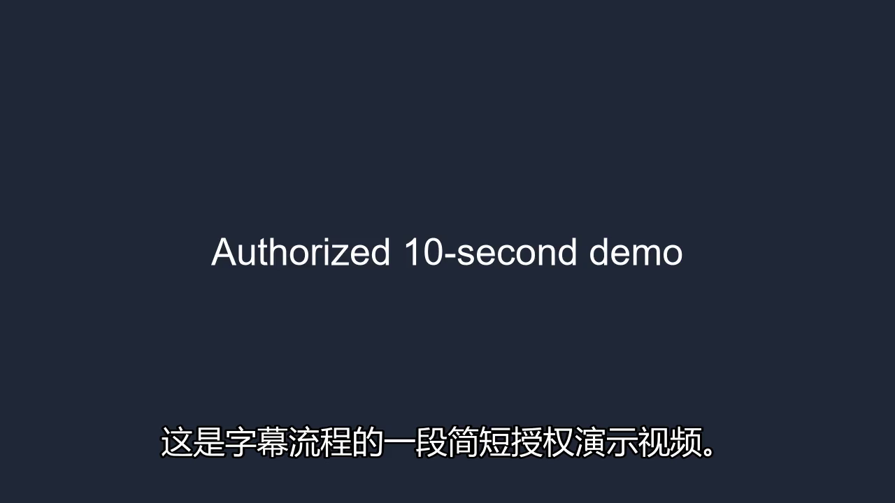
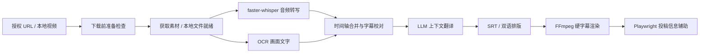

# YouTube 视频本地化工具（YouTube Bili Localizer）

面向**已获授权视频**的 Python 本地化工具：将本地文件或授权 URL 转为中文字幕硬字幕视频，并在人工确认前辅助填写 B 站投稿信息。

> 仅处理你拥有版权、已取得明确授权或许可证允许下载、改编与转载的素材。本项目不绕过登录、验证码、风控或版权限制；B 站流程不会自动点击“立即投稿”。

## 演示与能力

仓库内提供一段已授权的 10 秒输入样例：[`demo/authorized-demo-10s.mp4`](demo/authorized-demo-10s.mp4)。运行一次本地 demo 后，可在 `demo/artifacts/` 查看生成的源字幕、中文字幕和硬字幕成片。





- URL 或本地文件输入；`yt-dlp` 可按需通过本机 Chrome/Edge 获取 YouTube PO Token，并支持用户自己的登录 Cookies（不会绕过账号权限或平台验证）。
- `faster-whisper` 支持 CPU、CUDA 和可配置精度；OCR 可识别画面内英文字幕与信息标签。
- 音频/OCR 可分别使用，或按时间轴合并；转写、翻译和输出均保留可检查的 JSON/SRT 中间产物。
- OpenAI / DeepSeek 可进行源字幕校对、上下文分批翻译和投稿元数据生成。
- 支持中文、原文、双语字幕，动态换行、字体、描边、阴影和位置配置。
- 图形工作台（WebView 界面）：素材、处理、字幕精修、视频修改（删除/保留/静音/导出/重排）、发布辅助、任务历史；另保留 CLI。
- 三档资源模式：默认“均衡”限制下载带宽与 CPU 线程；“后台”优先保证其他软件流畅；“极速”释放全部资源。
- 自适应画面字幕 OCR：一次抽帧，优先上次成功区域，低置信度时再扩大搜索；支持配置 Tesseract 语言并明确显示是否回退到 Whisper。
- 桌面任务按“获取素材 → 字幕提取 → 翻译 → 渲染 → 发布辅助”独立运行；每阶段保存检查点，可取消、重试并在应用重启后从最后有效产物继续。
- 创建任务不会立即下载。链接、授权、Cookies、FFmpeg/ffprobe、所选 Whisper 模型、OCR、翻译 API、CUDA/精度、渲染编码器和磁盘空间会先在准备中心检查；缺失模型只允许用户明确点击安装。
- 字幕时间轴精修与视频片段级编辑均自动保持字幕对齐，处理结果（转写/OCR/翻译对照）实时可见。
- URL 默认限制为 1080p，可选 720p/原始画质；4K 原画会在开始前警告。截取视频开头使用快速封装，字幕渲染自动优先 NVIDIA NVENC，失败时降级 CPU。

## 5 分钟跑通

### 0. 前置要求（Windows）

直接使用发布页 EXE 的普通用户：双击启动后按“素材 → 处理 → 检查准备”操作。默认音频流程需要 FFmpeg 和所选 Whisper 模型；OCR 与投稿浏览器只在启用对应功能时需要。安装必须由用户在准备清单或顶部「依赖」中明确确认，完成后只重新检查，不会自动开始下载。应用会显示实际安装状态、进度、失败日志与重试入口，不要求手工配置 PATH。缺少 WebView2 时，桌面壳会在启动前提示并打开微软官方安装页。

下面仅适用于从源码运行：

1. **Python 3.10+**：从 <https://www.python.org/downloads/> 安装，勾选 **Add python.exe to PATH**；
2. **ffmpeg**：管理员 PowerShell 执行 `winget install Gyan.FFmpeg`，装完后重开终端（刷新 PATH）；
3. **Node.js**（可选但强烈建议）：YouTube 视频流需要 JS 挑战求解；
4. **Tesseract OCR**（可选，仅「画面字幕 OCR」需要）：`winget install UB-Mannheim.TesseractOCR`；
5. **NVIDIA GPU**（可选）：有 CUDA 时可用 `--device cuda` 加速转写。

> YouTube 会持续调整媒体验证。v0.2.3 默认开启「自动浏览器验证」：首次读取链接时可能短暂启动最小化的 Chrome/Edge，用于获取本次请求的 PO Token。公开内容通常不需要 Cookies；只有登录后才能观看的内容才应提供你自己的有效 cookies.txt。HTTP 403 不再被简单判定为“Cookies 错误”。详见 [v0.2.3 可靠性边界](docs/prd-youtube-reliability-v0.2.3.md)。

### 1. 源码安装

```powershell
git clone https://github.com/wanghaofu124/youtube-bili-localizer.git
cd youtube-bili-localizer
python -m venv .venv
.\.venv\Scripts\Activate.ps1
pip install -e ".[dev]"
playwright install chromium
```

复制 `.env.example` 为 `.env`，填写一个翻译服务的 API Key：

```powershell
copy .env.example .env
```

### 2. 处理授权样例

CPU 通用配置：

```powershell
yblocalizer process --file demo\authorized-demo-10s.mp4 --i-have-rights --translator deepseek --subtitle-source audio --device cpu --compute-type int8 --output-dir outputs\demo
```

处理时电脑仍需承担其他工作，可追加 `--resource-profile background`；默认值是 `balanced`，仅在确认无需同时使用其他重型软件时选择 `maximum`。

有 NVIDIA CUDA 环境时可改用：`--device cuda --compute-type float16`。成功后目录结构如下：

```text
outputs/demo/job-*/
├── source.srt                 # 英文源字幕
├── segments.source.json       # 带时间轴的源分段
├── zh.srt                     # 中文或双语字幕
├── segments.translated.json   # 翻译后的分段
├── publish_metadata.json      # 建议标题和标签
└── rendered.mp4               # 最终硬字幕视频
```

完整的 GUI、URL 输入、CUDA、OCR、字幕样式和投稿辅助说明请看[使用教程](docs/使用教程.md)。

## Windows EXE 打包（可选）

源码运行即可正常使用全部功能；如需免安装 EXE，用 PyInstaller 自行打包：

```powershell
powershell -ExecutionPolicy Bypass -File scripts\build_exe.ps1
```

产物位于 `dist\`（`YouTubeBiliLocalizer.exe` 为图形界面、`yblocalizer.exe` 为命令行）。图形界面的「依赖中心」可检查内置的 YouTube 浏览器验证组件，并安装或预下载 FFmpeg、Whisper small、Node.js、Tesseract 与投稿辅助浏览器；OCR、投稿等未选功能不会强迫安装。安装任务可以取消，关闭应用会终止其外部安装进程。命令行用户仍可自行管理这些系统组件。

公开交付应使用固定的 Python 3.12 构建环境：

```powershell
powershell -ExecutionPolicy Bypass -File scripts\build_release.ps1 -Clean -Version 0.2.5 -PythonExe C:\Python312\python.exe
```

`requirements-build.lock` 固定 Windows onedir 构建依赖。若已安装 Inno Setup 6，可继续执行 `scripts\build_installer.ps1` 生成带卸载项和快捷方式的普通用户安装程序；脚本会从 Inno 官方仓库获取固定提交的简体中文语言文件，并校验 SHA-256。公开 Release 应提供代码签名证书，并给两个脚本传入 `-SigningThumbprint` 与 `-RequireSignature`；本地测试包可以保持未签名，但不应冒充正式签名版本。

> **数据位置**：运行时的配置（`.env`）、任务输出、字幕、浏览器 Profile 与任务历史（SQLite）都保存在用户数据目录 `C:\Users\<用户名>\AppData\Roaming\YouTubeBiliLocalizer\`，与 EXE 安装目录分离——升级或重建 EXE 不会删除你的数据。

## 工作台前端

暖色 React 工作台在 [`frontend/`](frontend/) 实现（Vite + React，由本地 HTTP 桥 `yblocalizer.workbench_api` 提供 API）。处理页包含准备清单、五阶段执行卡片、逐阶段/一键运行、禁用原因和恢复入口；任务检查器显示每阶段状态，不再用一个总百分比掩盖实际工作。字幕翻译完成后即可进入编辑器校对，保存修改只使渲染及发布阶段失效。前端构建与交互测试：`cd frontend && npm test && npm run build`。

## 开发验证与性能基准

```powershell
# CI 同款：不下载媒体、不加载模型、不调用 API、不启动浏览器
python -m pytest -q
python -m compileall -q src

# 真实本机基准：会加载模型并调用 .env 配置的翻译服务
python scripts/benchmark_demo.py --device cpu --compute-type int8 --export-demo
python scripts/benchmark_demo.py --device cuda --compute-type float16
```

基准会对生产流水线的导入、音频提取、转写、字幕审校、翻译、投稿元数据生成及渲染逐阶段计时，并输出版本化 JSON 到 `benchmarks/runs/`。

### 已记录的本机基准

同一 10 秒、1280×720 授权样例，以 `small` Whisper、DeepSeek 翻译与 FFmpeg 渲染完整运行。端到端数据包含网络翻译和元数据生成延迟，不能泛化为其他视频或网络环境的性能承诺。

| 配置 | 转写 | 翻译 | 端到端 |
| --- | ---: | ---: | ---: |
| CPU / int8 | 36.085 秒 | 28.361 秒 | 74.492 秒 |
| RTX 5070 CUDA / float16 | 11.426 秒 | 21.656 秒 | 44.814 秒 |

完整配置、阶段耗时与产物摘要见 [CPU 记录](benchmarks/cpu.json) 和 [CUDA 记录](benchmarks/cuda.json)。

GitHub Actions 在 Ubuntu 的 Python 3.10 与 3.12 上运行编译检查和 mock 测试。测试覆盖字幕时间轴与排版、OCR/音频合并、翻译行数修复、中文结果验证、文案模板、输出目录安全清理、CLI 参数映射和完整流水线的 mock 成功/失败路径。

## 架构与关键取舍

v0.2 将 React 工作台确定为唯一新增功能的 UI，旧 Tk GUI 进入兼容维护。CLI 与桌面端复用同一组阶段函数；桌面端只负责调度，阶段产物、状态与配置指纹以原子任务清单和 SQLite 双重保存。应用退出时只把当前运行阶段标记为中断，重启后验证已有产物并等待用户确认继续。详细边界见 [v0.2 架构说明](docs/architecture-v0.2.md)。

| 设计 | 原因 |
| --- | --- |
| 重型依赖惰性导入 | CLI 帮助、测试和非模型功能不需要下载或加载 Whisper / Playwright。 |
| 音频与 OCR 双路径 | 语音转写覆盖对白，OCR 补足画面标签与已烧录字幕；合并时按时间重叠与文本相似度去重。 |
| 上下文分批翻译 | 控制单次 API 请求大小，同时在批次前后提供上下文，避免逐句直译。 |
| 动态字幕排版 | 根据语种、可用时长和字符数调整换行，限制屏幕行数以提升可读性。 |
| 人工确认投稿 | Playwright 仅协助上传和填写；用户核对分类、版权声明和内容后手动提交。 |

## 公开资产与安全

- 仅 `demo/authorized-demo-10s.mp4` 与从它生成的 `demo/artifacts/` 可作为公开演示媒体。
- `outputs/`、浏览器诊断截图、cookies、Profile、API 响应、日志及无明确授权素材一律忽略，禁止提交。
- `.env` 已忽略；请勿提交 API Key。有关本地开发与基准更新方式见 [benchmarks/README.md](benchmarks/README.md)。
